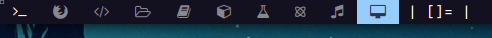

# textlayout-widget
A simple text based layout widget for awesome WM.

## Example

``` lua
textlayout-widget {
    tile = "[]="
}
```


The most right widget is the **tile** layout symbol (`[]=`) used in DWM.

## Installation

Copy widget file in your config files using:
### Git clone
``` bash
cd ~/.config/awesome
git clone https://github.com/nullbyto/textlayout-widget widgets/textlayout-widget
```

### OR

### Download the file only

``` bash
cd ~/.config/awesome
curl https://github.com/nullbyto/textlayout-widget/textlayout-widget.lua --create-dirs -o widgets/textlayout-widget.lua
```

## How to use

In your `rc.lua` or where ever your bar configurations are:

``` lua
local textlayout-widget = require("widgets.textlayout-widget")
-- Your widget can now be used
```

Add it to your wibox (without customization):

``` lua
    -- Add widgets to the wibox
    s.mywibox:setup {
        ...,
        { -- Left widgets
        ...,
        textlayout-widget {},
        },
    }
```

If you want customization, you can just add a specific layout name as argument to the constructor:

``` lua
    -- Add widgets to the wibox
    s.mywibox:setup {
        ...,
        { -- Left widgets
        ...,
        textlayout-widget {
                tile = "hello",
                floating = "i float",
            },
        },
    }
```

**alternatively** you can do that in a variable:

``` lua
local textlayout-widget = require("widgets.textlayout-widget")
-- Your widget can now be used
local textlayout = textlayout-widget {
    tile = "hello",
    floating = "i float",
}
```

and then down here, you just pass the variable:

``` lua
    -- Add widgets to the wibox
    s.mywibox:setup {
        ...,
        { -- Left widgets
        ...,
        textlayout,
        },
    }
```

### Default layout names set

``` lua
tile = "[]=",
fairv = "==",
max = "[M]",
floating = "><>",
dwindle = "[\\\\]",
spiral = "[@]",
```

### List of default layout names to customize
Reference: https://awesomewm.org/doc/api/libraries/awful.layout.html
``` text
cornernw
cornerne
cornersw
cornerse
fairh
fairv
floating
magnifier
max
fullscreen
spiral
dwindle
tile
tiletop
tilebottom
tileleft
```

#### Note:
- Any layout not set as default **nor** manually customized by the user will just use the **name** of the layout from the above list.
- Tested only on Awesome 4.3 (probably works on 4.0+)
